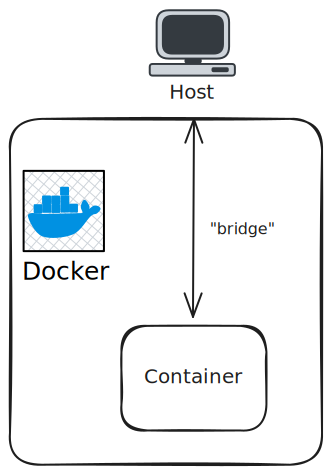

# `docker network` practice

See other of my *practices*:
- [iptables-practice](https://github.com/MoXcz/iptables-practice)
- [load-balancer-practice](https://github.com/MoXcz/load-balancer-practice)

Docker is used for *containerization* of applications, which are like lightweight virtual machines *with batteries included* (libraries, executables, and whatever other dependencies may be needed).

The purpose of containers is to be able to run applications without having to simulate a *hardware interface* to do so, that is, without needing *another computer* (or abstraction of a computer under a virtual machine).

The *network* in this context is then how to use these *containers* under this abstraction. Fortunately, Docker already has some pretty neat networks by default: `bridge`, `host`, and `none`.

When first installing Docker an interface called `docker0` is created (use `netstat -ie` to see it), which is used as the default `bridge` network as mentioned above (see [bridge-network](./bridge-network.md)).



To test how this works:

```sh
docker build . -t srv-test
docker run -it --rm --name srv -p 8080:8080 srv-test
# open a new terminal and issue a GET request
curl localhost:8080
```

The response should be something like `Hi from :8080 (hostname: da12f89eac4d)`, the number after `hostname:` is the *container id*, which you can see using `docker ps` while the container is still running.
