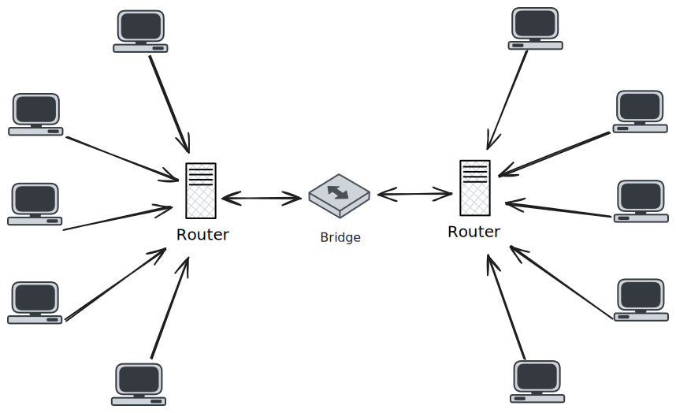

# Bridge Network

A bridge network resides under the *link layer* of TCP-IP and it *forwards traffic between different network segments*.

> *It can be either a hardware device or some piece of software running from within the same host machine* (Docker is one such example).

In other words, it can be used to act as the **bridge** between different devices (or group of devices) under a network. In the case of Docker, the bridge is between the *Docker network* and the host.

